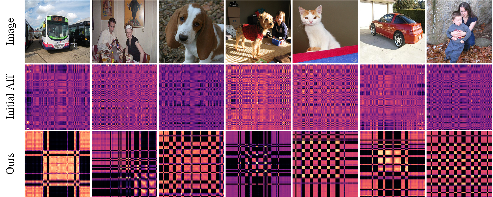

# 基于亲和向量一致性的弱监督语义分割(Weakly Supervised Semantic Segmentation Based on Affnity Vector Consistency)代码正整理中...
## Download datasets
* For the PASCAL VOC 2012 dataset, you can download it from the [official website](http://host.robots.ox.ac.uk/pascal/VOC/voc2012/VOCtrainval_11-May-2012.tar). In addition, you need to download the augmented annotations [SegmentationClassAug.zip](https://www.dropbox.com/scl/fi/xccys1fus0utdioi7nj4d/SegmentationClassAug.zip?rlkey=0wl8iz6sc40b3qf6nidun4rez&e=1&dl=0) from the [SBD dataset](https://www.cs.cornell.edu/~bharathh/).
* For the MS COCO 2014 dataset, you can download the [training set](http://images.cocodataset.org/zips/train2014.zip) and [validation set](http://images.cocodataset.org/zips/val2014.zip) from the [official website](https://cocodataset.org/). At the same time, download the corresponding [segmentation labels](https://drive.google.com/file/d/147kbmwiXUnd2dW9_j8L5L0qwFYHUcP9I/).

## Usage

Step 1: Train AVC

```
python train_AVC.py --model_path $Backbone_model_path
```

Step 2: Initial seed generation and evaluation

Step 2.1: Generate initial seed label (Seed)

```
python infer_cam.py --model_path $AVC_model_path
```

Step 2.2: Evaluating initial seed
```
python evaluation.py --comment train_cam --predict_dir data/AVC/out_cam
```

Step 3: Use CRF or [PSA](https://github.com/jiwoon-ahn/psa) to refine the initial seed (Seed) and generate pseudo-label mask (Mask)

Step 3.1: Train PSA
```
python train_aff.py --model_path res38_cls.pth
```
Step 3.2: Using PSA for random walk propagation
```
python infer_aff.py --model_path resnet38_aff.pth
```
Step 3.3: Evaluate pseudo-label masks
```
python evaluation.py --comment train_rw --predict_dir data/AVC/out_rw --type png
```

Step 4: To further evaluate the performance of the method, we followed previous workflows such as [MCTformer](https://github.com/xulianuwa/MCTformer) and [ACR](https://github.com/sangrockEG/ACR). Replace the Ground Truth label with a pseudo-label mask and use the RN-38 backbone network to train a fully supervised semantic segmentation model [DeeplabV1](https://github.com/YudeWang/semantic-segmentation-codebase/tree/main/experiment/seamv1-pseudovoc)

Step 4.1: Train deeplabV1-RN38
```
python train_deeplab.py
```

Step 4.2: Generate segmentation results and evaluate semantic segmentation models
```
python test_deeplab.py
```
## Experimental Results
Initial Seed and Pseudo-Label Mask Quality

<table  align="center">
  <tr>
    <th>Model</th>
    <th>Dataset Type</th>
    <th>Google Drive</th>
    <th>Seed</th>
    <th>+CRF</th>
    <th>Mask</th>
  </tr>
  <tr>
    <td rowspan="2" align="center">AVC</td>
    <td align="center">VOC</td>
    <td align="center"><a href="https://drive.google.com/file/d/1GOAl3B3bywI5plCI3o7YLeEmeTCIAMdq/view?usp=drive_link">Weights</a></td>
    <td align="center"><a href="https://drive.google.com/file/d/1fEtLiFbvgT3cOGr2hCT7qMZGjD6iDl-p/view?usp=drive_link">75.8</a></td>
    <td align="center"><a href="https://drive.google.com/file/d/1v1HsX_Lc00TnEPveQGl7LlLJLbE5CNiE/view?usp=drive_link">77.5</a></td>
    <td align="center"><a href="https://drive.google.com/file/d/14-1WR1V6zm3RFAwDnuABeDUZCQkkULYu/view?usp=drive_link">77.8</a></td>
  </tr>
  <tr>
    <td align="center">MS COCO</td>
    <td align="center"><a href="https://drive.google.com/file/d/1yRzMH-LbsK3IidONspOJYuZaNTgdxM96/view?usp=drive_link">Weights</a></td>
    <td align="center">45.8</td>
    <td align="center">-</td>
    <td align="center"><a href="https://drive.google.com/file/d/1UFEk8uN_81E0hLU50oR9FsiL6QvAon_u/view?usp=drive_link">48.4</a></td>
  </tr>
</table>

Semantic Segmentation Quality

<table  align="center">
  <tr>
    <th>Model</th>
    <th>Backbone</th>
    <th>Dataset Type</th>    
    <th>Google Drive</th>
    <th>Test</th>
    <th>Val</th>
  </tr>
  <tr>
    <td rowspan="2" align="center">Deeplab-V1</td>
    <td rowspan="2" align="center">ResNet-38</td>
    <td align="center">VOC</td>
    <td align="center"><a href="https://drive.google.com/file/d/1Wsru6lHMhh8gYdO3Uep6XSq8f9BzHghT/view?usp=drive_link">Weights</a></td>
    <td align="center"><a href="http://host.robots.ox.ac.uk:8080/anonymous/NHKQPH.html">75.1</a></td>
    <td align="center"><a href="http://host.robots.ox.ac.uk:8080/anonymous/OE2YQO.html">74.6</a></td>
  </tr>
  <tr>
    <td align="center">MS COCO</td>
    <td align="center">-</td>
    <td align="center">-</td>
    <td align="center"><a href="https://drive.google.com/file/d/1NarR6JQArhc7gLuSZ1wEDH--HZgY-rRU/view?usp=drive_link">47.2</a></td>
  </tr>
</table>

## Other Results
Comparison of affinity map between the original method (second row) and the AVC method (third row)
<p align="center">
  
</p>
